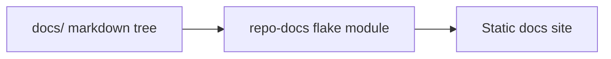

# Getting Started

Import the module from a consumer flake:

```nix
{
  imports = [ repo-docs.flakeModules.default ];

  perSystem = { ... }: {
    docsSite = {
      enable = true;
      contentDir = ./docs;
      excludePaths = [ "private" ];

      site = {
        title = "My Project";
        publicBaseUrl = "https://docs.example.com";
        routeBase = "/docs";
      };

      navigation.sectionLabels = {
        api = "API Reference";
      };

      templateFiles = {
        "src/styles/global.css" = ./docs-theme/global.css;
      };
    };
  };
}
```

Then use:

- `nix build .#docs-site`
- `nix run .#docs-dev`
- `nix run .#docs-preview`

If you do not set navigation explicitly, the module derives it from the docs tree automatically.


