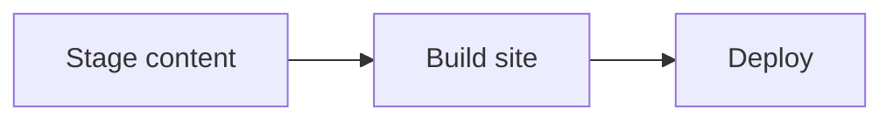
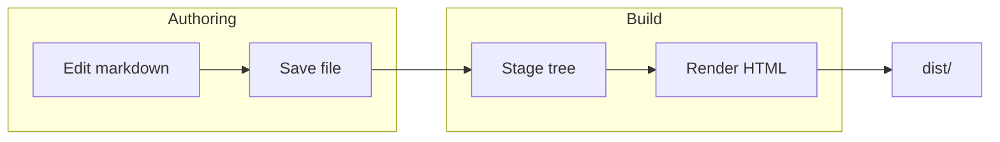
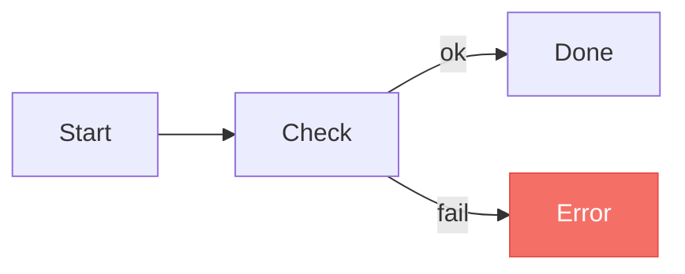
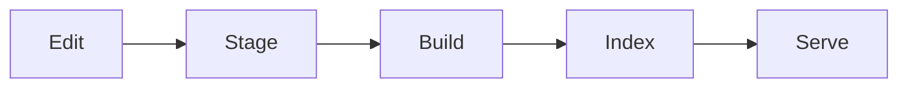
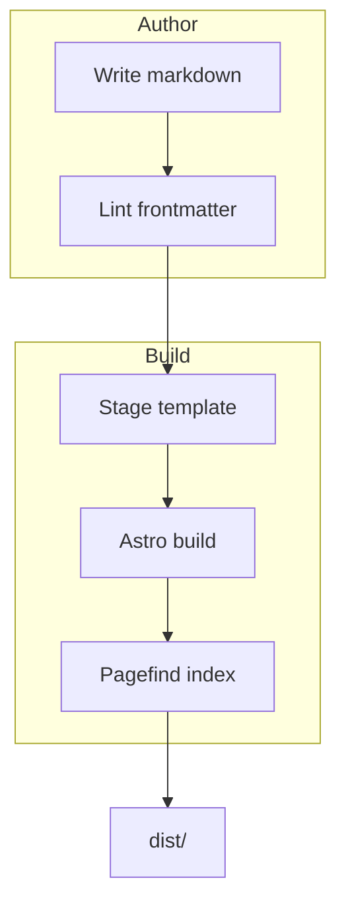
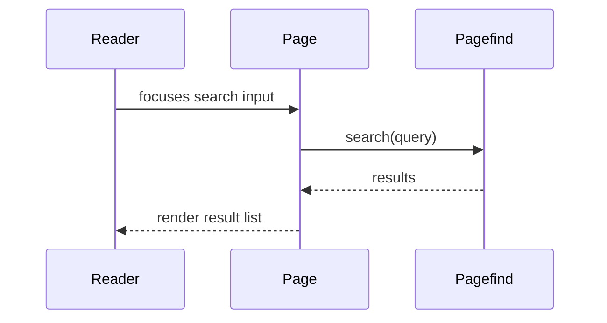

# Mermaid Diagrams

Mermaid diagrams are wired into the markdown pipeline by default. Any fenced code block tagged `mermaid` is rendered client-side into an SVG card with a Fullscreen button in the toolbar. There's nothing to configure on the consumer side beyond writing the diagram.

This page is about the part Mermaid doesn't decide for you: composition. The defaults look fine for two-node sketches, but real diagrams (5–20 nodes, mixed shapes, branching) need a small amount of intentional structure to read well across `cortex-light`, `cortex-dark`, and `cortex-slate`.

## How each theme styles diagrams

The template picks a Mermaid theme to match the active palette:

| Site theme | Mermaid theme | Node colour behaviour |
|------------|---------------|------------------------|
| `cortex-light` | `default` | All nodes the same neutral fill |
| `cortex-dark` | `dark` (github-dark family) | All nodes the same neutral fill |
| `cortex-slate` | `base` + tuned `themeVariables` | **Cycles through 5 muted tints**: indigo → teal → amber → rose → sage |

Two practical consequences:

- On `cortex-slate`, **the order you declare nodes determines their colour**. The first node is indigo, the second teal, the third amber, the fourth rose, the fifth sage, and the sixth wraps back to indigo. Rearranging the source rearranges the palette.
- On the other themes, ordering doesn't affect colour, but it still affects layout — Mermaid's auto-layout follows declaration order to break ties.

## Composition rules of thumb

### Keep labels short

Mermaid can render long labels, but it still sizes the graph from the text. Anything past ~20 characters either wraps awkwardly or pushes neighbouring nodes apart and breaks rhythm with the prose around the diagram. Prefer:

over `A[Stage the content directory into the template tree]`. If a node really needs a sentence, put the sentence in the surrounding prose and use a short label in the diagram.

### Pick the direction that matches the data

| You're showing | Use |
|----------------|-----|
| A pipeline / linear flow | `flowchart LR` |
| A hierarchy / decomposition | `flowchart TB` |
| A small cycle | `flowchart LR` with a back-edge |
| A wide fan-out (>4 children) | `flowchart TB` so children stack vertically |

`BT` (bottom-to-top) is rarely the right answer — readers expect time and causation to flow either left-to-right or top-down.

### Use `subgraph` for grouping, not for decoration

Subgraphs draw a box around a set of nodes and let Mermaid's layout engine pack them tightly. Reach for them when a diagram has more than ~8 nodes and a real conceptual grouping exists:

Subgraphs collapse on `cortex-slate` to a one-step-lifted background (`#2d333b`) so they never compete with the node colours.

### Sequence diagrams: cap actors at four

A sidebar-default-width docs page gives roughly 720 px to the prose column. Sequence diagrams allocate a vertical lane per actor; past four actors the lanes get narrow enough that signal labels wrap or overflow. If you genuinely need five or more actors, reach for the Fullscreen button (top-right of the diagram card) and tell the reader to do the same — or split the interaction into two diagrams.

### State diagrams: lean on the cycle

`stateDiagram-v2` on `cortex-slate` cycles through the same five-tone palette via Mermaid's `fillType0..7` slots, so state diagrams get visual rhythm "for free". Order your states deliberately: make the first state in each subgraph the conceptual "primary" so it gets indigo, and the terminal state last (often gets sage, which reads as "settled").

## Test in both modes

If you've enabled `themeModes`, every diagram has to land on both palettes. The two failure modes to watch for:

1. **Edge labels that disappear** on one palette. Mermaid edge labels inherit the page background — if the diagram contains text floating along an edge, check it's legible after toggling.
2. **Subgraph titles that under-contrast** on the lighter palette. Long subgraph names with low-key surrounding chrome can wash out on `cortex-light`.

The mode toggle in the sidebar footer lets you flip between them without reloading; the diagrams re-render on the fly.

## When to use `class` overrides

For one-off semantic colouring (e.g. "this node is a failure state, paint it red"), Mermaid's `classDef` directive works in all three themes:

Use this sparingly — the strength of the slate cycling palette is that it doesn't *mean* anything, so colour stays available as a signal when you need it.

## Worked examples

A clean five-node pipeline (each node lands on a different slate tint):

A two-stage build with grouping:

A bounded sequence (three actors, fits the prose column):

If a diagram resists looking good after a couple of attempts, it's usually a sign the diagram is doing too much. Split it.
