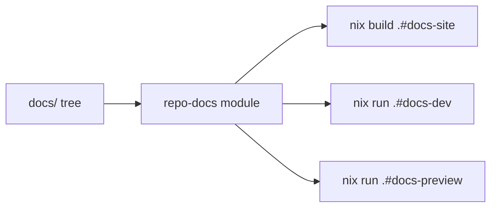
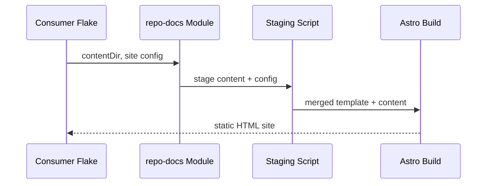
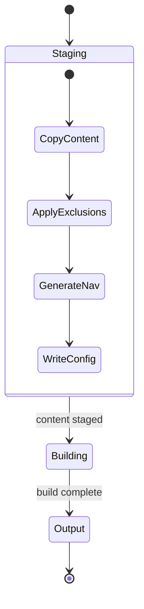

# Rendering Example

This page exercises every rendering feature to verify that the template produces correct output.

## Inline Formatting

Regular text with **bold**, *italic*, ***bold italic***, `inline code`, and [a link](#inline-formatting).

## Headings

### Third Level

#### Fourth Level

##### Fifth Level

## Lists

Unordered:

- First item
- Second item with `inline code`
- Third item
  - Nested item
  - Another nested item
- Fourth item

Ordered:

1. First step
2. Second step
3. Third step
   1. Sub-step
   2. Another sub-step

## Blockquote

> This is a blockquote. It can contain **bold**, *italic*, and `code`.
>
> It can span multiple paragraphs.

## Horizontal Rule

---

## Code Blocks

Nix expression:

```nix
{
  description = "Example flake";

  inputs.nixpkgs.url = "github:NixOS/nixpkgs/nixos-unstable";

  outputs = { nixpkgs, ... }:
    let
      pkgs = nixpkgs.legacyPackages.x86_64-linux;
    in {
      packages.default = pkgs.hello;
    };
}
```

TypeScript:

```typescript
interface Config {
  title: string;
  baseUrl: string;
  sections: Section[];
}

function buildNavigation(config: Config): Sidebar {
  return config.sections.map((section) => ({
    label: section.label,
    items: section.entries.map(resolveEntry),
  }));
}
```

Shell session:

```bash
nix build .#docs-site
nix run .#docs-dev -- --port 8080
```

Tree-sitter–powered highlighting (the `ts-json` language is registered via `docsSite.languages`):

```ts-json
{
  "docs": {
    "enabled": true,
    "theme": "cortex-light",
    "languages": ["wire", "capnp", "ts-json"]
  },
  "ports": [4321, 4322],
  "meta": null
}
```

## Tables

| Feature | Status | Notes |
|---------|--------|-------|
| Mermaid diagrams | Supported | Fullscreen toggle included |
| LaTeX math | Supported | Via KaTeX |
| Syntax highlighting | Supported | All common languages |
| Lean 4 theory pages | Supported | See the generated [Theory section](../../Theory/) |
| Typst manuscripts | Supported | See [Typst Manuscripts](typst-manuscripts.md) |
| MDX | Supported | Via `@astrojs/mdx` |
| Dark mode | Default | Customizable via CSS variables |

## Mermaid Diagrams

Flowchart:



Sequence diagram:



State diagram:



## LaTeX Math

Inline math: The quadratic formula is $x = \frac{-b \pm \sqrt{b^2 - 4ac}}{2a}$.

Display math:

$$
\int_{-\infty}^{\infty} e^{-x^2} dx = \sqrt{\pi}
$$

A matrix:

$$
A = \begin{bmatrix}
a_{11} & a_{12} & \cdots & a_{1n} \\
a_{21} & a_{22} & \cdots & a_{2n} \\
\vdots & \vdots & \ddots & \vdots \\
a_{m1} & a_{m2} & \cdots & a_{mn}
\end{bmatrix}
$$

Euler's identity: $e^{i\pi} + 1 = 0$

A summation:

$$
\sum_{k=1}^{n} k = \frac{n(n+1)}{2}
$$

## Images

Images use standard markdown syntax and are constrained to content width:


## Nested Content

A list containing code and emphasis:

1. Run the build:
   ```bash
   nix build .#docs-site
   ```
2. Check the output contains **all expected pages**
3. Verify the site config has `title` set to `"repo-docs"`

## Footnotes

Reference-style footnotes work via standard GFM syntax[^1] and are rendered as a bibliography block at the bottom of the page[^kerr2024].

[^1]: A simple numbered footnote with the back-reference arrow rendered automatically.
[^kerr2024]: Kerr, J. (2024). *Documentation as a system input*. Self-published. Footnotes accept arbitrary identifiers, not just numbers.

## References

For end-of-paper bibliographies that don't tie to inline `[^N]` markers, write a `## References` (or `## Bibliography`) heading followed by a numbered Markdown list. The styling auto-applies — italic titles via `*…*`, monospace brand-tinted URLs, tabular-nums counter in muted ink. The same shape as the Footnotes block above, so a doc that uses both reads consistently.

1. Astro Technology Company. *Astro: The web framework for content-driven websites*. <https://astro.build>
2. Pagefind. *Pagefind: static low-bandwidth search at scale*. <https://pagefind.app>
3. de Moura, L., Ullrich, S. (2021). *The Lean 4 Theorem Prover and Programming Language*. CADE 28: 625–635.
4. Christiansen, D. R. *Verso: authoring tools for Lean*. <https://github.com/leanprover/verso>
5. Madsen, M., Haug, L. (2023). *Typst: a new markup-based typesetting system that is powerful, easy to learn, and fast*. <https://typst.app>
6. Knuth, D. E. (1984). *Literate Programming*. The Computer Journal 27(2):97–111.
7. GitHub. *Primer: GitHub's design system*. <https://primer.style>
8. Mermaid Contributors. *Mermaid: generation of diagrams from textual descriptions*. <https://mermaid.js.org>
9. Sotin, B. (2018). *KaTeX: the fastest math typesetting library for the web*. <https://katex.org>
10. Hercules CI. *flake-parts: a flake-friendly module system*. <https://flake.parts>
